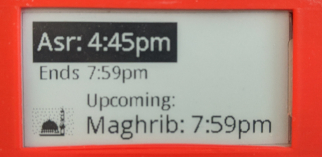

# e-Paper Info

Code demonstares how to display information on Waveshare e-Paper Display connected to Raspberry Pi. In this case it displays prayer times on the 2.13 inch display.



## Setup

* Clone this repository

* _Optional_: Activate virtual Python environment.

* Install included dependencies:
```
python setup.py install
```
Note: you can then delete directories _build_ and _dist_

* Download and install dependencies (make changes to file as necessary):
```
pip install -r requirements.txt
```

NOTE: numpy is installed because waveshare library imports it (but does not use).

It could take a while to install on Raspberry Pi. If that happens then your choices are:  either comment out the import & don't install numpy, or install the wheel file directly.

## Configure

Make changes to file _config.py_, especially the following:
* Location coordinates
* Timezone info
* e-Ink device

Also, if using mixins.salah check settings are appropriate for your case (check comments in source code).

## Requirements

* Waveshare e-Paper Display
(code tested on 2.13 inch Rev2)

* Raspberry Pi

## Run

* Change directory to _info_epd_
* Run:
```
python info_epd
```

To have it run automatically, edit file _launcher.sh_ and add entry crontab file (see comments in file).

## Credits

Waveshare: https://github.com/waveshare/e-Paper

PrayTimes: http://praytimes.org/
